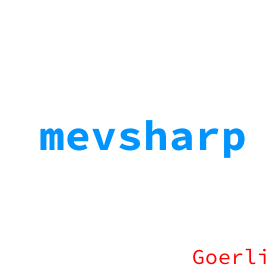

# DAppNodePackage-mevsharp (goerli config)

mevsharp is a MEV proxy written in C# that allow validators to outsource block construction for maximum extractable value.

mevsharp acts as an intermediary between your validator and external block builders. By connecting mevsharp to various relays, mevsharp will evaluate bids from external builders and choose the one that provide the most profitable block for your validator to build.

|      Updated       |   Champion/s    |
| :----------------: | :-------------: |
| :heavy_check_mark: | @mevsharp |
